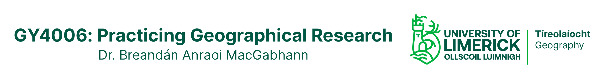

# 07: Rivers Symbology ```[C-grades and above]```
___

As for the lakes, the data for the rivers should be visible on the map in a random colour - although as lines rather than as polygon shapes. Let's change that too.

## Visualising the Data
___

### C-grades

Right click on the ```WATER_RivNetRoutes``` layer in the Layers panel, and choose Properties. In the Properties window, choose Symbology on the left.

Click on the coloured Color bar to open the Select Color window.

Feel free to play around with this for a bit, to see what options are available – a handy feature I use a lot here is the option to add colours to the panel at the bottom, so that I can re-use the same colours in other layers.

Choose an appropriate colour for the rivers layer, and click OK twice to close the Select Color and Properties windows.

Save the project before continuing.

### B-grades and above

By default, all of the rivers are being shown the same size and colour – but in reality of course, not all rivers are the same.

Lucky for us, the EPA included some data with the coordinates which tells us something about the size of the rivers. Let’s look at the data the EPA including with the co-ordinates. Right click the ```WATER_RivNetRoutes``` layer, and choose ```Open Attribute Table```.

Each row in this attribute table corresponds to one river segment. Have a look at the different columns of data. The first, ```OBJECTID```, is a unique identifier number for each river segment. There’s also the name of the river, ```EPA_NAME```; and a column of numbers labelled ```ORDER_```.

We are going to use this column, ```ORDER_```, to change how we display the rivers. This column records the river’s *Strahler stream order*. The stream order is a way of describing river systems. Headwater or starting streams are numbered 1; where two #1s meet, the river becomes a #2. Two #2s make a #3, two #3s make a #4… and so on. In general, a higher number makes a bigger river.

Close the attribute table. Right click on the ```WATER_RivNetRoutes``` layer in the Layers panel, and choose Properties and Symbology.

At the top of the Symbology window, change Single Symbol to Categorised. This tells QGIS that we have different categories of lines in the layer, and each category of line should have a different colour.

Now we need to tell QGIS which data to use to see which category each line is in. From the dropdown menu beside Value, choose ORDER_ – the column we discussed above. 

Now click Classify.

In the central panel, you should now see 8 different coloured lines, labelled 1-7 and all others. By default, QGIS gives each of these a random colour. If you click the dropdown beside Color ramp, you can choose different sets of colours. Again, feel free to play around with this a bit to see the possibilities, and choose a set of colours you think would be appropriate for the rivers.

You can also adjust each of the category symbols individually, by double clicking on the coloured lines for each category. Try this for order 1 streams.

I would suggest that you use these options to change the Width of the lines for the different stream orders so that order 1 streams are smallest, and order 7 are the largest. That way, bigger rivers will display bigger on the map. 

When you’re happy that the rivers will display in a way that’s useful and appropriate, click all the OK’s to close the symbol and properties windows, and save the project before continuing.


___
[Previous](./06_lake_symbology.md) | [Next](./008_your_AOI.md)
